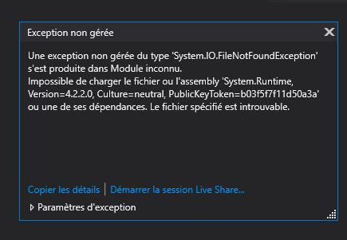

# C-Sharp-101

## What!?
... This  🤷🏾‍♀️

## Why!?
At my internship, we are working on ASP.NET and Azure Devops... So... To understand what I am doing (and not break the website when I edit something) I need to learn a little bit of C# before ! 

## Where!?
From my home and outside in the yard (when the sun is shinning... *So... Never?* )

## How!?
By following the "C# Fundamentals" from Scott Allen on Pluralsight :muscle:

## When!?
RIGHT NOW ! 😅