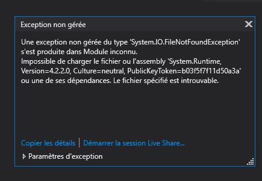

# C-Sharp-101

## What!?
... This  
🤷🏾‍♀️

## Why!?
For my internship, we will work on ASP.NET and Azure Devops... So... I need to learn a little bit of C# before ! 

## Where!?
From my home, outside in the yard (when the sun is shinning), and from BeCode

## How!?
By followin and old Elephorm tutorial

## When!?
RIGHT NOW ! 😅